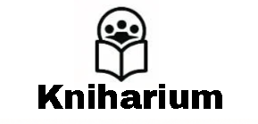
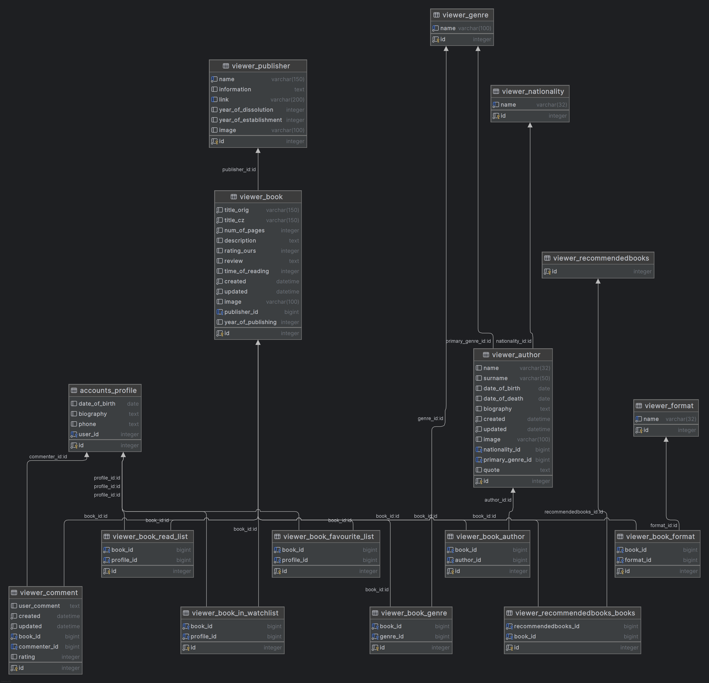

Autoři: Patrik Liptaj a Kamil Kotlář

### Cíl projektu Kniharium
Naším cílem bylo vytvořit platformu, která propojí milovníky knih a poskytne přehledný systém správu a sdílení informací o knihách.

#### Hlavní záměry:
- vytvořit databázi knih
- spojit uživatele a jejich názory
- zjednodušit přistup k údajům o knihách
- vytvořit přehledný systém pro správu knih

### Co dokáže náš projekt
- přidávání dat přes admin rozhraní, botů nebo UI
- vytvoření boti dokážou přidávat data, překládat data, vypočítat dobu čtení, doplnit prázdné místa v databázi a komentovat
- nabízí detailní informace o knihách, autorech a nakladatelstvích
- nabízí seznam všech knih, autorů a nakladatelství
- umožňuje uživatelům vyhledávat knihy, autory, nakladatelství
- umožňuje uživatelům filtrovat knihy
- umožňuje vytvořit a upravit profily uživatelů
- uživatelé mohou přidávat komentáře
- uživatelé si mohou přidávat knihy do svých profilů
- pomáhá uživatelům najít knihu na portálu Heuréka
- stránka má chatbot, funkci náhodné knihy
- stránka zobrazuje dnešní datum a svátek
- stránka nabízí:
  - naposledy přidané knihy, autory, nakladatelství
  - nejlépe hodnocené knihy
  - náhodnou knihu, náhodné autory
  - největší nakladatelství
- stránka nabízí API

### Uživatel a stránka
#### Neregistrovaný uživatel může:
- využívat rady chatbota
- získat informace o knihách, autorech a nakladatelstvích
- číst recenze
- najít knihu na portálu Heuréka
- vyhledat knihu
- nerozhodný uživatel může využít funkci vyhledání náhodné knihy
- připomenout si datum a svátek
- prohlížet profily ostatních uživatelů
- zaregistrovat se a vytvořit profil

#### Registrovaný uživatel navíc může:
- hodnotit a komentovat knihu
- vymazat a aktualizovat svůj profil
- přidat si knihy do watchlistu, oblíbených a přečtených
- přidat se mezi partnery využitím formuláře

#### Partner navíc může:
- přidávat a aktualizovat data
- využívat boty

#### Admin navíc může:
- přidávat, upravovat a vymazávat data přes admin rozhraní
- přidávat, upravovat a vymazávat data přes UI
- schvalovat partnery

### Použité technologie
- Python, Django (backend)
- HTML, CSS, JavaScript (frontend)
- SQLite3 (databáze)

### ER diagram

### Screenshots

### Licence.
Tento projekt je licencovaný pod MIT licencí. Více informací najdete v souboru `LICENSE`.